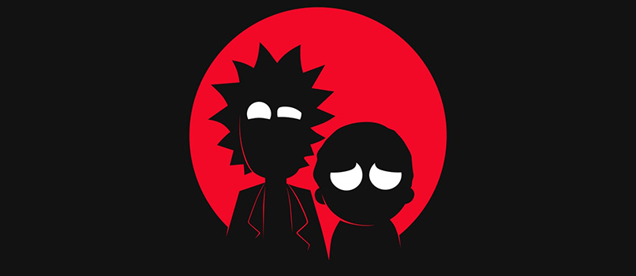

<h1 align="center"> Arctic Horizon 2 Recauchutado </h1>
<h4 align="center">Versión del famoso skin Horizon 2 de JurialMunkey Adaptado para el addon Palantir</h4>

> [!IMPORTANT]
> [Enlace al Tutorial de instalación y configuración.](https://telegra.ph/AH2-Tutorial-02-02)

### Actualización 0.2.5
- [x] Corregido BUG a la hora de mostrar el icono de clasificación MPAA cuando no existe esa información.
- [x] Mostrar iconos de estudio en el footer de los Widgets a pantalla completa (Decoraciones  - Iconos de estudio.)
- [x] Mostrar iconos de clasificación por edades en el footer de los Widgets a pantalla completa. (decoraciones - Clasificación (MPAA) - España)

### Actualización 0.2.4
- [x] Nuevo pack de iconos "Modernos" (una nueva visión recauchutada).
- [x] Icono por defecto si no se encuentra la clasificación por edad (fondo negro con dos guiones blancos). Independiente del estilo elegido.
- [x] Nueva opción de menú en Decoraciones, en la sección Pie de página, llamada "Estilo de iconos MPAA" que permite seleccionar entre "Modernos" (por defecto), "Antiguos" (los típicos de años pasados en TV) o los "Oficiales" (aparentemente los iconos oficiales de MPAA en España, si alguien los ha visto por ahí debe ser el único 😅).

### Actualización 0.2.3
- [x] Mostrar temporadas en footer.
- [x] Mostrar episodios en footer.
- [x] Mostrar iconos de estudio en footer (Decoraciones  - Iconos de estudio.)
- [x] Mostrar proveedores de contenido (servicios de streaming) en footer (Decoraciones  - Iconos de proveedores de medios)
- [x] Mostrar iconos de clasificación por edades en footer. (decoraciones - Clasificación (MPAA) - España)
- [x] Nueva entrada de menú en Extras para activar los iconos MPAA oficiales en lugar de los obsoletos (obsoletos por defecto).
- [x] 2 nuevos iconos oficiales MPAA España (los de las "i").
- [x] 7 nuevos iconos obsoletos MPAA (más vistosos, aunque menos oficiales).
- [x] 1 nuevo icono, del pack destinado a widgets, de Movistar+.
- [x] Llevar textos de entradas del menú Extras a ficheros de localización.
- [x] Llevar texto de botón "Ver" a ficheros de localización.

### Actualización 0.2.2
- [x] Añadido script.wikipedia como addon requerido al skin.
- [x] Cambios en el botón WIKI de la pantalla de Información. Que no estaba funcionando.
- [x] Cambios miniatura Episodios. Ahora se muestra correctamente la miniatura de los episodios.
