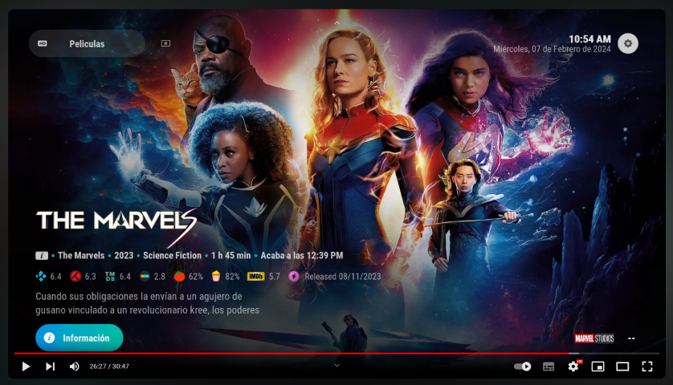

<h1 align="center"> Arctic Horizon 2 Recauchutado </h1>
<h4 align="center">Versión del famoso skin Horizon 2 de JurialMunkey Adaptado para el addon Palantir</h4>

> [!IMPORTANT]
> [Enlace al Tutorial de instalación y configuración.](https://telegra.ph/AH2-Tutorial-02-02)

### Actualización 0.3.1 - 11/04/2024
- [x] Menús por defecto para Palantir en instalación nueva. Permitirá que en futuras actualizaciones de Palantir podamos actualizar los enlaces de los widgets y compartirlos con una nueva versión sin mayores dolores de cabeza para gente que no se quieran complicar, o como base para los que sí.
- [x] Botón de reset de menús que permite restablecer los menús por defecto del punto anterior (se perderá la configuración hecha por el usuario). En ajustes de la skin - Detalles - Extras, la opción que dice "¡CUIDADO!" 😉
- [x] Posibilidad de hacer una copia/restauración de la configuración de menús de todas las skin modificadas por el usuario (dependiente de SO, no se puede pasar de PC a Android y viceversa ya que puede contener rutas absolutas). Requiere de los plugins Skin Helper Service y Skin Helper Service Skin Backup (en repositorio de Marcelveldt, disponible en Luar).

### Actualización 0.3 - 21/03/2024
- [x] Clearlogo en vista Temporadas, Capítulos (dependiente de TMDB Helper del Repositorio Joseska).
- [x] Valoraciones en la vista de Temporadas, Capítulos (dependiente de TMDB Helper del Repositorio Joseska).
- [x] Clearlogo en el OSD (Reproductor de videos) (dependiente de TMDB Helper del Repositorio Joseska).
- [x] Clearlogo en vista Temporadas, Capítulos (dependiente de TMDB Helper del Repositorio Joseska).
- [x] Marcadores y capítulos en el OSD (Reproductor de videos). Situados en el grupo de botones de la izquierda en el OSD, pulsar abajo.
- [x] Elenco y mas información en el OSD (Reproductor de videos). Situados en el grupo de botones de la derecha en el OSD, pulsar abajo dos veces.
- [x] Traducir los textos acompañantes de las fechas de emisión/estreno en la línea de información (infoline).
- [x] Visualizar cambios en addons en la vista de addons (news).

### Actualización 0.2.8 (0.2.8.1) - 22/02/2024
- [x] Arreglado BUG en vista Series.
- [x] Nueva vista alternativa para ver los capítulos y las temporadas en las series pinchando en el botón "Ver" (o dando a la derecha) en la pantalla de información.
- [x] Nueva opción en los ajustes del skin para cambiar el comportamiento del botón "Ver" en la pantalla del Información (Skin - Configurar skin - Comportamiento - Desactivar Vista Alternativa Series)
- [x] Nueva vista Trailers Youtube (Junto con un dos nuevos Botones dentro del botón trailers en la pantalla de información [Trailers desde TMDB / Trailers desde Youtube]).
- [x] Cambios para mostrar correctamente los videos de las Series/Películas en la pantalla Detalles (Botón Detalles en la pantalla de información).
- [x] Priorizar el título del ListItem correspondiente para que si en ajustes de Palantir está desmarcado "Incluir información extra en los títulos" no se vea la información de año e idiomas en los títulos de las series.
- [X] Nueva opción que espera un tiempo para ejecutar Palantir y esperar a que cargue. A elegir entre 4 opciones Nada (por defecto, como hasta antes de este cambio) /Rápido/Medio/Lento, en función de la potencia del dispositivo. 
Durante ese tiempo la skin se verá vacía y se mostrará dos notificaciones, una al empezar y otra cuando sólo quede por cargar Palantir.
Ajuste en "Skin - Configurar skin - Comportamiento - "Esperar al Sistema y a Palantir (tiempo)".
- [X] Compatibilidad con Kodi 21 Omega.

### Actualización 0.2.7
- [x] Rediseño de pantalla de carga de la skin, corrigiendo el bug por el que se tapaba los elementos relativos a Perfiles de Kodi.
- [x] Nueva opción en los ajustes del skin con enlace al tutorial (Skin - Configurar skin - Soporte)
- [x] Título en infoline con autoscroll para evitar que se corte la línea si es demasiado larga al añadir muchos elementos, como género, director y tiempo de finalilzación del contenido.
- [x] Corregido valoración de Kodi en infoline que no se mostraba.
- [x] Iconos ordenados por categorias para una busqueda mas simple.
- [x] Modificación de algunos de los iconos MPAA del estilo "Modernos". Algunos son ahora más legibles y con mayor contraste.
- [x] Cambio de Icono por defecto si no se encuentra la clasificación por edad (dos guiones blancos sin fondo). Independiente del estilo elegido.

### Actualización 0.2.5
- [x] Corregido BUG a la hora de mostrar el icono de clasificación MPAA cuando no existe esa información.
- [x] Mostrar iconos de estudio en el footer de los Widgets a pantalla completa (Decoraciones  - Iconos de estudio.)
- [x] Mostrar iconos de clasificación por edades en el footer de los Widgets a pantalla completa. (decoraciones - Clasificación (MPAA) - España)

### Actualización 0.2.4
- [x] Nuevo pack de iconos "Modernos" (una nueva visión recauchutada).
- [x] Icono por defecto si no se encuentra la clasificación por edad (fondo negro con dos guiones blancos). Independiente del estilo elegido.
- [x] Nueva opción de menú en Decoraciones, en la sección Pie de página, llamada "Estilo de iconos MPAA" que permite seleccionar entre "Modernos" (por defecto), "Antiguos" (los típicos de años pasados en TV) o los "Oficiales" (aparentemente los iconos oficiales de MPAA en España, si alguien los ha visto por ahí debe ser el único 😅).

### Actualización 0.2.3
- [x] Mostrar temporadas en footer.
- [x] Mostrar episodios en footer.
- [x] Mostrar iconos de estudio en footer (Decoraciones  - Iconos de estudio.)
- [x] Mostrar proveedores de contenido (servicios de streaming) en footer (Decoraciones  - Iconos de proveedores de medios)
- [x] Mostrar iconos de clasificación por edades en footer. (decoraciones - Clasificación (MPAA) - España)
- [x] Nueva entrada de menú en Extras para activar los iconos MPAA oficiales en lugar de los obsoletos (obsoletos por defecto).
- [x] 2 nuevos iconos oficiales MPAA España (los de las "i").
- [x] 7 nuevos iconos obsoletos MPAA (más vistosos, aunque menos oficiales).
- [x] 1 nuevo icono, del pack destinado a widgets, de Movistar+.
- [x] Llevar textos de entradas del menú Extras a ficheros de localización.
- [x] Llevar texto de botón "Ver" a ficheros de localización.

### Actualización 0.2.2
- [x] Añadido script.wikipedia como addon requerido al skin.
- [x] Cambios en el botón WIKI de la pantalla de Información. Que no estaba funcionando.
- [x] Cambios miniatura Episodios. Ahora se muestra correctamente la miniatura de los episodios.
